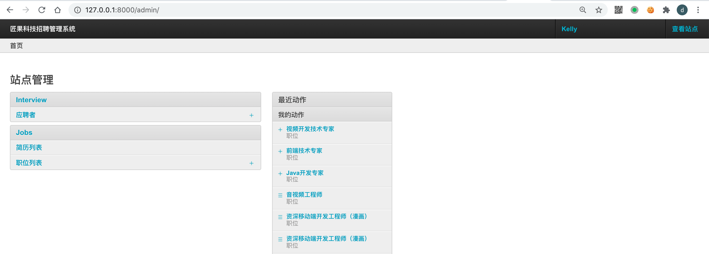
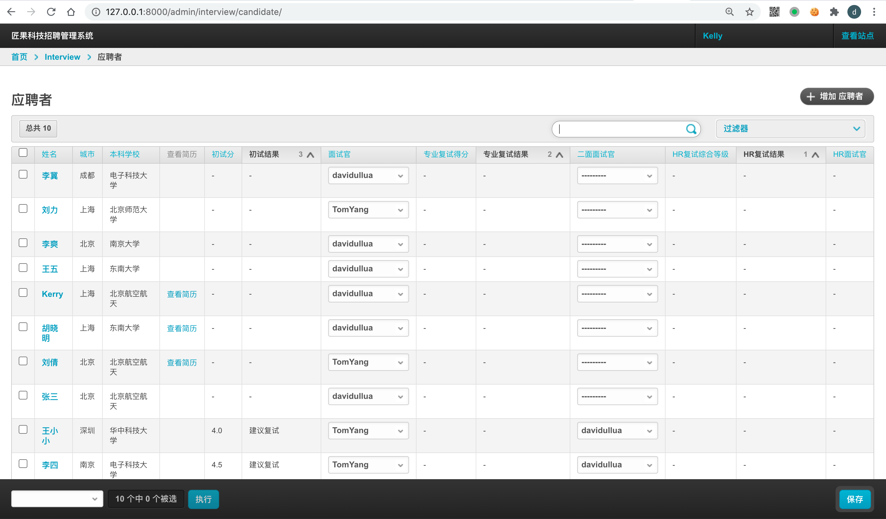
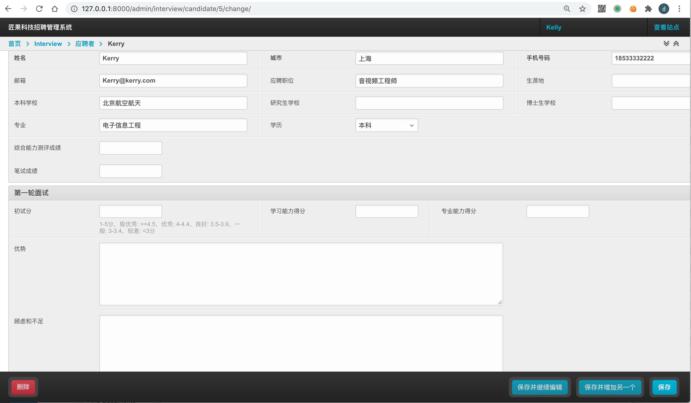
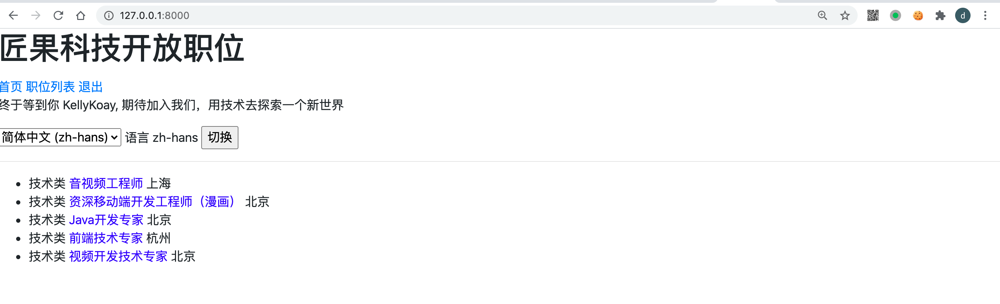
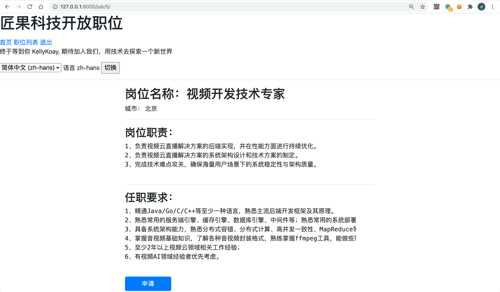

匠果招聘：极客时间《Django快速开发实战》视频课程代码仓库，一个招聘面试中即刻能用的开源项目。

## 匠果招聘：项目说明

用做创业公司职位发布，简历投递，招聘管理的开源项目，基于高效的Django & Python开发。
优秀的产品经理，能够做好迭代版本规划。

最初，这是一个使用 Python Django 两天开发出来的项目，经过逐步完善可以满足不同企业的招聘管理需求。
可集成企业域账号、发布职位、候选人可以投递简历、可以在面试过程中评估简历。 可以导入，导出候选人数据。

面试通知跟 钉钉群集成。

## 博客地址

部分技术细节的详细介绍, 参考博客地址:
[若谷技术分享](https://blog.ruoguedu.com/)

## 项目效果

招聘后台 - 首页


招聘后台 - 候选人列表



招聘系统后台 - 评估候选人


对外招聘网站 - 职位列表


对外招聘网站 - 申请职位



### 运行的前提条件

机器上有安装有Python, Django. 参考:
https://docs.djangoproject.com/

### 如何运行
本地和生产环境分别运行如下命令:
* python3 ./manage.py runserver 127.0.0.1:8000 --settings=settings.local
* python3 ./manage.py runserver 127.0.0.1:8000 --settings=settings.production

然后可以通过访问如下两个页面 
* http://127.0.0.1:8000 首页
* http://127.0.0.1:8000/admin 管理后台

### 命令行导入候选人

* python3 manage.py import_candidates --path /path/to/your/file.csv

### OpenLDAP/Active Directory集成
* 1.settings/base.py中配置LDAP相关的映射信息 （用户尝试登陆时自动创建账号，但创建的账号 is_staff = false,不能登陆系统）
* 2.运行 ./manage.py ldap_sync_users 来同步LDAP账号到 Django 账号库， 使用用户在 django 后台有账号。
* 3.admin登陆后台，编辑用户属性，设置为 is_staff （使得用户能登陆）, 同时添加到自己建的群组: interviewer （使得用户有权限做面试操作）

### 钉钉消息通知

在 settings/local.py 或者 settings/production.py 中配置群机器人的 WebHook ， 用来发送消息通知。
DINGTALK_WEB_HOOK = "https://oapi.dingtalk.com/robot/send?access_token=xsxxx"

### 集成 Sentry
安装 sentry-sdk
    $ pip install --upgrade sentry-sdk

在 settings/local.py, settings/production.py 中加上 sentry 的初始化配置
```python
import sentry_sdk
from sentry_sdk.integrations.django import DjangoIntegration

sentry_sdk.init(
    dsn="http://xxx@recruit.xxxx.com:9000/2",
    integrations=[DjangoIntegration()],
    # performance tracing sample rate, 采样率, 生产环境访问量过大时，建议调小（不用每一个URL请求都记录性能）
    traces_sample_rate=1.0, # 
    
    # If you wish to associate users to errors (assuming you are using
    # django.contrib.auth) you may enable sending PII data.
    send_default_pii=True
)
```

### 集成 Celery

* $ brew install redis  # on mac
* $ sudo apt-get install redis # on ubuntu/debian

* $ pip install -U celery
* $ pip install "celery[redis,auth,msgpack]"
* $ pip install -U flower


## local.py, production.py 里面添加 Celery 配置
```python
CELERY_BROKER_URL = 'redis://localhost:6379/0'
CELERY_RESULT_BACKEND = 'redis://localhost:6379/1'
CELERY_ACCEPT_CONTENT = ['application/json']
CELERY_RESULT_SERIALIZER = 'json'
CELERY_TASK_SERIALIZER = 'json'
CELERY_TIMEZONE = 'Asia/Shanghai'
CELERYD_MAX_TASKS_PER_CHILD = 10
CELERYD_LOG_FILE = os.path.join(BASE_DIR, "logs", "celery_work.log")
CELERYBEAT_LOG_FILE = os.path.join(BASE_DIR, "logs", "celery_beat.log")
```

启动本地 Celery 异步任务服务 & Flower 监控服务
* $ DJANGO_SETTINGS_MODULE=settings.local celery -A recruitment worker -l info

* $ DJANGO_SETTINGS_MODULE=settings.local celery -A recruitment flower 

celery 从  4.x 升级到 5.x
* $ celery upgrade settings path/to/settings.py

### 基础功能列表
* 管理职位
* 候选人浏览职位、投递职位 
* 导入候选人信息
* 面试评估反馈
* 域账号集成 (LDAP账号集成)

### 进阶功能
* 钉钉消息通知集成，面试消息及时通知钉钉群（也可以发送到 企业微信群/Slack等）
* 候选人列表筛选和查询 
* 候选人数据导出（导出为 CSV） 
* 权限控制：面试官和 HR 不同的权限控制，面试官的数据权限（能录入自己需要反馈的面试环节的内容），数据集权限（看到自己需要评估的候选人），功能权限（导出数据）控制

### 扩展功能 
* 通知面试官面试 
* 列表页可以查看简历
* 国际化
* 错误日志上报
* 提供 Rest API (Celery Rest Framework)
* 异步任务与定时任务 (Celery集成)


### run in docker 
交互运行:
docker run -it --rm -p 8000:8000  --entrypoint /bin/sh  ihopeit/recruitment-base:0.8

指定本地源码目录:
docker run -it --rm -p 8000:8000 -v "$(pwd)":/data/recruitment  --entrypoint /bin/sh  ihopeit/recruitment-base:0.8

指定加载源码 && 环境变量：
docker run --rm -p 8000:8000 -v "$(pwd)":/data/recruitment  --env server_params="--settings=settings.local"  ihopeit/recruitment-base:0.8